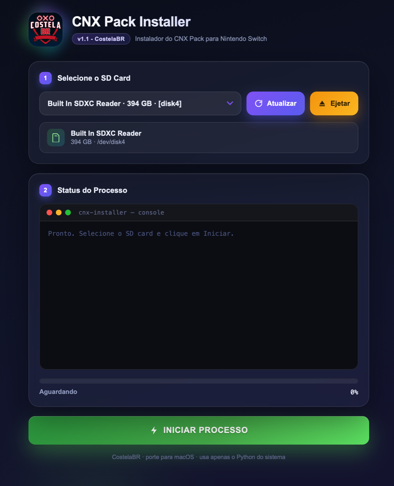
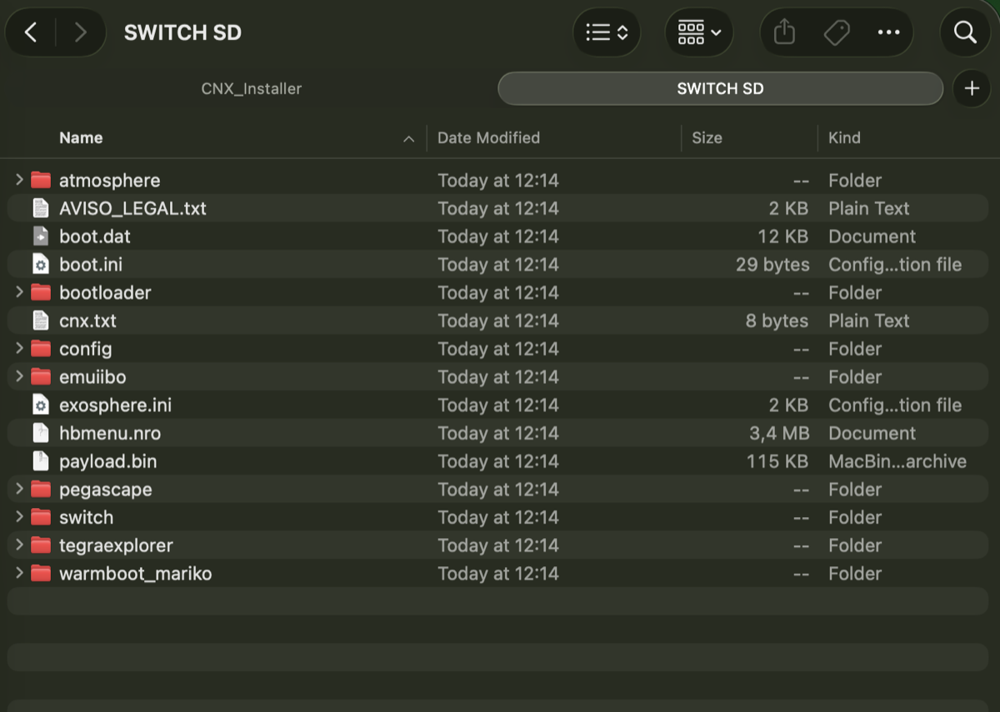

# CNX Pack Installer — macOS

> 🇧🇷 Português abaixo · 🇺🇸 English below

Port para **macOS** do `CNX_Installer_v1.1`, originalmente feito para Windows.
Instala o **CNX Pack** (custom firmware Atmosphère) em um cartão SD de Nintendo Switch.

macOS port of `CNX_Installer_v1.1` (originally Windows-only).
Installs the **CNX Pack** (Atmosphère custom firmware) onto a Nintendo Switch SD card.

> **Créditos / Credits:** o CNX Pack é desenvolvido e mantido por **CostelaBR** —
> repositório oficial / official repo: **https://github.com/CostelaCNX/CNX**.
> Este projeto é apenas um instalador não-oficial para macOS. /
> This is an unofficial macOS installer; all firmware content belongs to the original project.

---

## Screenshots

| Idle | Running | Done |
|---|---|---|
|  |  |  |

---

<a name="portugues"></a>
## 🇧🇷 Português

### O que faz

1. Lista apenas os discos externos/removíveis (nunca toca no disco interno)
2. Formata o microSD selecionado em **FAT32** (exigido pelo CFW do Switch)
3. Baixa o CNX Pack mais recente direto do [release oficial](https://github.com/CostelaCNX/CNX/releases/latest) (~160 MB)
4. Extrai todos os arquivos no cartão
5. Extrai o pacote secundário escondido em `bootloader/bootlogo_atmo_sys.bmp`

### Requisitos

- **macOS 10.15 (Catalina) ou superior**
- **Conexão com a internet** (baixa ~160 MB do GitHub)
- Um leitor de cartão SD / o cartão conectado
- Um **Python com Tk 8.6+** (veja abaixo)

> ⚠️ **macOS recente (Sequoia/Tahoe):** o Python que vem no sistema (`/usr/bin/python3`)
> usa um **Tk 8.5.9 antigo** que abre a **janela vazia**. Instale um Python com Tk
> moderno via [Homebrew](https://brew.sh):
>
> ```bash
> brew install python-tk@3.13
> ```
>
> O app detecta esse Python automaticamente. Em versões mais antigas do macOS o
> Python do sistema ainda funciona, sem instalar nada.

### Como usar

**Opção A — Dois cliques (mais fácil)**

1. Clique com o botão direito em **`CNX_Installer.app`** → **Abrir**
2. Clique em **Abrir** no aviso de segurança (necessário porque o app não é assinado)
3. Selecione o cartão SD na lista e clique em **INICIAR PROCESSO**

> **Por que botão direito → Abrir?** O Gatekeeper do macOS bloqueia apps não
> assinados na primeira execução. Botão direito → Abrir contorna isso uma vez.
> Depois você pode abrir com dois cliques normalmente.

**Opção B — Terminal**

```bash
# macOS recente (após brew install python-tk@3.13):
python3.13 ~/Documents/apps/CNX_Installer/CNX_Installer_mac.py

# macOS antigo (Tk do sistema ainda funciona):
/usr/bin/python3 ~/Documents/apps/CNX_Installer/CNX_Installer_mac.py
```

> Se a janela abrir **vazia**, é o Tk antigo do `/usr/bin/python3` — use um Python
> com Tk 8.6+ (`brew install python-tk@3.13`).

### Solução de problemas

| Problema | Solução |
|---|---|
| **Janela abre vazia** | Tk antigo do `/usr/bin/python3`. Rode `brew install python-tk@3.13` e abra de novo |
| "App está danificado" / não abre | No Terminal: `xattr -cr ~/Documents/apps/CNX_Installer/CNX_Installer.app` e tente de novo |
| Cartão SD não aparece | Reconecte o cartão e clique em **Atualizar** |
| Falha ao formatar | Abra o Utilitário de Disco, ejete/desmonte o cartão e tente de novo |
| Falha no download | Verifique a internet; o app tenta automaticamente o repositório reserva |
| Console mostra **"failed to open payload.bin"** | O cartão precisa ser **MBR** (não GPT). Reformate com: `diskutil eraseDisk FAT32 "SWITCH SD" MBRFormat /dev/diskN` e copie o pacote de novo. O app já formata em MBR a partir da v1.1. |

> ℹ️ **Esquema de partição:** o Switch (e modchips como picofly/hwfly) só leem
> cartões com partição **MBR**. O macOS formata em GPT por padrão, o que faz o
> console bootar com erro. O instalador usa `MBRFormat` para evitar isso.

---

<a name="english"></a>
## 🇺🇸 English

### What it does

1. Lists your external/removable disks (never touches the internal drive)
2. Formats the selected SD card as **FAT32** (required by Switch CFW)
3. Downloads the latest CNX Pack from the [official release](https://github.com/CostelaCNX/CNX/releases/latest) (~160 MB)
4. Extracts all files to the SD card
5. Extracts a secondary package hidden inside `bootloader/bootlogo_atmo_sys.bmp`

### Requirements

- **macOS 10.15 (Catalina) or later**
- **Internet connection** (downloads ~160 MB from GitHub)
- An SD card reader / the SD card connected
- A **Python with Tk 8.6+** (see below)

> ⚠️ **Recent macOS (Sequoia/Tahoe):** the built-in Python (`/usr/bin/python3`)
> ships an **old Tk 8.5.9** that opens a **blank window**. Install a Python with a
> modern Tk via [Homebrew](https://brew.sh):
>
> ```bash
> brew install python-tk@3.13
> ```
>
> The app detects that Python automatically. On older macOS the system Python
> still works with nothing to install.

### How to run

**Option A — Double-click (easiest)**

1. Right-click **`CNX_Installer.app`** → **Open**
2. Click **Open** in the security dialog (required because the app is unsigned)
3. Select your SD card from the dropdown and click **INICIAR PROCESSO**

> **Why right-click → Open?** macOS Gatekeeper blocks unsigned apps on first
> launch. Right-click → Open bypasses that one time. After that you can
> double-click normally.

**Option B — Terminal**

```bash
# Recent macOS (after brew install python-tk@3.13):
python3.13 ~/Documents/apps/CNX_Installer/CNX_Installer_mac.py

# Older macOS (system Tk still works):
/usr/bin/python3 ~/Documents/apps/CNX_Installer/CNX_Installer_mac.py
```

> If the window opens **blank**, that's the old Tk in `/usr/bin/python3` — use a
> Python with Tk 8.6+ (`brew install python-tk@3.13`).

### Troubleshooting

| Problem | Fix |
|---|---|
| **Window opens blank** | Old Tk in `/usr/bin/python3`. Run `brew install python-tk@3.13` and reopen |
| "App is damaged" / won't open | Run: `xattr -cr ~/Documents/apps/CNX_Installer/CNX_Installer.app` then retry |
| SD card not listed | Reconnect the SD card, then click **Atualizar** |
| Format fails | Open Disk Utility, eject/unmount the SD card first, then retry |
| Download fails | Check your internet connection; the app will auto-retry with the backup repo |
| Console shows **"failed to open payload.bin"** | The card must be **MBR** (not GPT). Reformat with: `diskutil eraseDisk FAT32 "SWITCH SD" MBRFormat /dev/diskN` and copy the pack again. The app formats as MBR since v1.1. |

> ℹ️ **Partition scheme:** the Switch (and modchips like picofly/hwfly) only read
> cards with an **MBR** partition map. macOS formats as GPT by default, which makes
> the console boot with an error. The installer uses `MBRFormat` to avoid this.

---

## Estrutura / Layout

```
CNX_Installer/
├── CNX_Installer.app/        ← dois cliques aqui / double-click this
│   └── Contents/
│       ├── MacOS/CNX_Installer        (launcher → /usr/bin/python3)
│       ├── Resources/CNX_Installer_mac.py
│       └── Info.plist
├── CNX_Installer_mac.py      ← script standalone (mesma coisa / same thing)
├── screenshots/
└── README.md
```

## Como contribuir / Contributing

🇧🇷 Contribuições são bem-vindas! Abra uma *issue* para relatar bugs ou sugerir
melhorias, ou mande um *pull request*:

1. Faça um fork deste repositório
2. Crie uma branch (`git checkout -b minha-melhoria`)
3. Teste no macOS antes de enviar — o app usa apenas o Python do sistema (`/usr/bin/python3`), sem dependências
4. Abra o PR descrevendo a mudança

🇺🇸 Contributions are welcome! Open an *issue* for bugs or ideas, or send a
*pull request*:

1. Fork this repo
2. Create a branch (`git checkout -b my-improvement`)
3. Test on macOS before submitting — the app only uses system Python (`/usr/bin/python3`), no dependencies
4. Open the PR describing your change

> ⚠️ Mantenha `CNX_Installer_mac.py` e `CNX_Installer.app/Contents/Resources/CNX_Installer_mac.py` idênticos (a cópia no bundle deve refletir o script principal). /
> Keep both copies of `CNX_Installer_mac.py` in sync.

---

## Licença / License

O CNX Pack é distribuído sob **GPLv3** pelo projeto original.
The CNX Pack is distributed under **GPLv3** by the original project.
See https://github.com/CostelaCNX/CNX for details.
